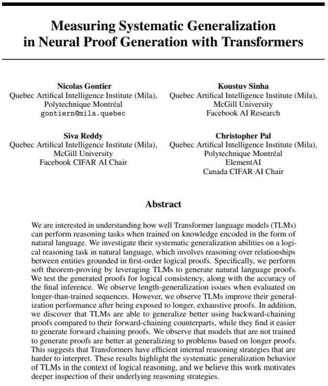

# NeurIPS 2020 paper

Code for the paper
"[Measuring Systematic Generalization in Neural Proof Generation with Transformers](https://arxiv.org/abs/2009.14786)"


### Installation

Tested on this environment:
- Python 3.6.8
- CUDA Version: 10.2

````
pip install -r requirements.txt
git clone https://github.com/NVIDIA/apex 
````
NOTE: `apex` must be cloned in the current directory or manually added to the `$PYTHONPATH`.

### Download data

Manually from this link:
https://drive.google.com/file/d/1TUXEcyR5i3TCrYtlTIX65swQH56TSiJj/view?usp=sharing
and unzip into the `./data/` folder

or

````
cd ./data
chmod +x setup.sh
./setup.sh
````

##### The file structure of the data is the following:
````yaml
data/
|  backward/  # proof sentences are reversed, from answer to facts (~backward chaining)
|  |  test/
|  |  |  {2|3|4|5|6|7|8|9|10}/
|  |  |  |  {long|short}_proof_1.{2|3|4|5|6|7|8|9|10}_test_facts_ANON.txt  # target used to evaluate
|  |  |  |  queries_1.{2|3|4|5|6|7|8|9|10}_test_{amt|facts}_ANON.txt       # prefix used to generate
|  |  train/
|  |  |  {long|short}_proof_1.{2|4|6}_train_{amt|facts}_anon.txt.4000
|  |  valid/
|  |  |  {long|short}_proof_1.{2|4|6}_valid_{amt|facts}_anon.txt.4000
|  forward/  # proof sentences are in order, from facts to answer (~forward chaining)
|  |  test/
|  |  |  {2|3|4|5|6|7|8|9|10}/
|  |  |  |  {long|short|no}_proof_1.{2|3|4|5|6|7|8|9|10}_test_facts_ANON.txt  # target used to evaluate
|  |  |  |  queries_1.{2|3|4|5|6|7|8|9|10}_test_{amt|facts}_ANON.txt          # prefix used to generate
|  |  train/
|  |  |  {long|no|short}_proof_1.{2|4|6}_train_{amt|facts}_anon.txt.4000
|  |  valid/
|  |  |  {long|no|short}_proof_1.{2|4|6}_valid_{amt|facts}_anon.txt.4000
#               ^                   ^              ^
#          long, short, or no       ^              ^
#           proof strategies        ^              ^
#                                   ^              ^
#               lvl 2, 4, 6 family stories         ^
#                                                  ^
#          family graph expressed with the 'facts' or 'amt' template
````

### Run experiments

#### Training
Tested with this hardware requirements:
- gpu: 6 * 32 Gb Tesla V100
- cpu: 6 * 16 Gb

````
#
# FACTS
#

# --no proof sentences
python launch_job.py --config configs/gpt_tiny.json --dataset clutrr1_no_proof_facts_2+clutrr1_no_proof_facts_4+clutrr1_no_proof_facts_6 --experiment_name gpt_tiny_anon

# --forward proof sentences
python launch_job.py --config configs/gpt_tiny.json --dataset clutrr1_long_proof_facts_2+clutrr1_long_proof_facts_4+clutrr1_long_proof_facts_6 --experiment_name gpt_tiny_anon
python launch_job.py --config configs/gpt_tiny.json --dataset clutrr1_short_proof_facts_2+clutrr1_short_proof_facts_4+clutrr1_short_proof_facts_6 --experiment_name gpt_tiny_anon

# --reversed proof sentences
python launch_job.py --config configs/gpt_tiny.json --dataset clutrr1_long-proof-rev_facts_2+clutrr1_long-proof-rev_facts_4+clutrr1_long-proof-rev_facts_6 --experiment_name gpt_tiny_anon
python launch_job.py --config configs/gpt_tiny.json --dataset clutrr1_short-proof-rev_facts_2+clutrr1_short-proof-rev_facts_4+clutrr1_short-proof-rev_facts_6 --experiment_name gpt_tiny_anon


#
# AMT
#

# --no proof sentences
python launch_job.py --config configs/gpt_tiny.json --dataset clutrr1_no_proof_amt_2+clutrr1_no_proof_amt_4+clutrr1_no_proof_amt_6 --experiment_name gpt_tiny_anon

# --forward proof sentences
python launch_job.py --config configs/gpt_tiny.json --dataset clutrr1_long_proof_amt_2+clutrr1_long_proof_amt_4+clutrr1_long_proof_amt_6 --experiment_name gpt_tiny_anon
python launch_job.py --config configs/gpt_tiny.json --dataset clutrr1_short_proof_amt_2+clutrr1_short_proof_amt_4+clutrr1_short_proof_amt_6 --experiment_name gpt_tiny_anon

# --reversed proof sentences
python launch_job.py --config configs/gpt_tiny.json --dataset clutrr1_long-proof-rev_amt_2+clutrr1_long-proof-rev_amt_4+clutrr1_long-proof-rev_amt_6 --experiment_name gpt_tiny_anon
python launch_job.py --config configs/gpt_tiny.json --dataset clutrr1_short-proof-rev_amt_2+clutrr1_short-proof-rev_amt_4+clutrr1_short-proof-rev_amt_6 --experiment_name gpt_tiny_anon
````

#### Generation

Tested with this hardware requirements:
- gpu: 1 * 12 Gb
- cpu: 2 * 4 Gb
````
chmod +x generate_proofs-answers.sh
chmod +x generate_answers.sh

#
# FACTS
#

# --no proof sentences
./generate_proofs-answers.sh np facts  # given facts story + query generate 'none' + answer
./generate_answers.sh np facts         # given facts story + query + 'none' generate answer

# --forward proof sentences
./generate_proofs-answers.sh lp facts  # given facts story + query generate long-proof + answer
./generate_proofs-answers.sh sp facts  # given facst story + query generate short-proof + answer
./generate_answers.sh lp facts  # given facst story + query + long-proof generate answer
./generate_answers.sh sp facts  # given facts story + query + short-proof generate answer

# --reversed proof sentences
./generate_proofs-answers.sh lpr facts  # given facts story + query generate long-proof-rev + answer
./generate_proofs-answers.sh spr facts  # given facts story + query generate short-proof-rev + answer
./generate_answers.sh lpr facts  # given facts story + query + long-proof-rev generate answer
./generate_answers.sh spr facts  # given facts story + query + short-proof-rev generate answer


#
# AMT
#

# --no proof sentences
./generate_proofs-answers.sh np amt  # given amt story + query generate 'none' + answer
./generate_answers.sh np amt         # given amt story + query + 'none' generate answer

# --forward proof sentences
./generate_proofs-answers.sh lp amt  # given amt story + query generate long-proof + answer
./generate_proofs-answers.sh sp amt  # given amt story + query generate short-proof + answer
./generate_answers.sh lp amt  # given amt story + query + long-proof generate answer
./generate_answers.sh sp amt  # given amt story + query + short-proof generate answer

# --reversed proof sentences
./generate_proofs-answers.sh lpr amt  # given amt story + query generate long-proof-rev + answer
./generate_proofs-answers.sh spr amt  # given amt story + query generate short-proof-rev + answer
./generate_answers.sh lpr amt  # given amt story + query + long-proof-rev generate answer
./generate_answers.sh spr amt  # given amt story + query + short-proof-rev generate answer
````

#### Evaluation

````

````

### Acknowledgements

We greatly thank Sandeep Subramanian (https://github.com/MaximumEntropy) for allowing us to use and share some of his experimental code, from which this repository was constructed.

### Cite

To cite our paper, please use the following bibtex:
````
@incollection{gontier2020measuring,
  title = {Measuring Systematic Generalization in Neural Proof Generation with Transformers},
  author = {Gontier, Nicolas and Sinha, Koustuv and Reddy, Siva and Pal, Christopher},
  booktitle = {Advances in Neural Information Processing Systems 33},
  year = {2020},
  publisher = {Curran Associates, Inc.},
  url = {https://arxiv.org/pdf/2009.14786.pdf}
}
````
